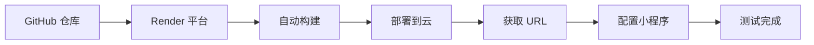

# 后端部署配置

本目录包含乡村旅游推荐系统后端服务的完整部署配置和文档。

## 📁 目录结构

```
deploy/
├── README.md           # 部署说明文档（本文件）
├── QUICK_START.md      # 快速部署指南（5分钟上手）
├── DEPLOYMENT_GUIDE.md # 详细部署指南（完整步骤和故障排查）
├── render.yaml         # Render.com 自动部署配置
├── Dockerfile          # Docker 容器化配置
└── .env.example        # 环境变量完整示例
```

## 🚀 快速开始

### 推荐方案：Render.com（完全免费）

Render.com 提供免费的 Web 服务和 PostgreSQL 数据库，是最适合快速测试的平台。

**快速部署（5分钟）：**

1. **注册 Render**
   - 访问 https://render.com
   - 使用 GitHub 账号登录

2. **创建数据库**
   - 点击 "New +" → "PostgreSQL"
   - Name: `tourism-recommender-db`
   - Region: 选择 Singapore（国内访问更快）
   - Plan: Free

3. **创建 Web 服务**
   - 点击 "New +" → "Web Service"
   - 选择你的 GitHub 仓库
   - Runtime: Go
   - Build Command: `go build -o main main.go`
   - Start Command: `./main`
   - 添加环境变量（见下方）

4. **等待部署完成**
   - 约 3-5 分钟后获得 URL
   - 测试：`curl https://your-app.onrender.com/api/v1/health`

详细步骤请查看：**[QUICK_START.md](./QUICK_START.md)**

---

## 🔧 环境变量配置

本应用使用环境变量进行配置。本地开发时通过 `.env` 文件提供，云端部署时通过平台的环境变量配置界面设置。

### 必需的环境变量

| 变量名 | 说明 | 默认值 | 示例 |
|--------|------|--------|------|
| `DB_PASSWORD` | 数据库密码（必需） | - | `your_secure_password` |

**重要**：`DB_PASSWORD` 是唯一必需的环境变量，不设置会导致应用启动失败。

### 可选的环境变量

#### 应用配置

| 变量名 | 说明 | 默认值 | 生产环境推荐 |
|--------|------|--------|-------------|
| `GIN_MODE` | 应用运行模式 | `debug` | `release` |
| `SERVER_PORT` | 服务器端口 | `8080` | `8080` |

#### 数据库配置

| 变量名 | 说明 | 默认值 | 生产环境推荐 |
|--------|------|--------|-------------|
| `DB_HOST` | 数据库主机 | `localhost` | 从平台获取 |
| `DB_PORT` | 数据库端口 | `5432` | `5432` |
| `DB_USER` | 数据库用户 | `postgres` | 从平台获取 |
| `DB_NAME` | 数据库名称 | `tourism_recommender` | `tourism_recommender` |
| `DB_SSLMODE` | SSL 模式 | `disable` | `require` |

#### 管理员默认配置

这些变量用于创建默认管理员账号。

| 变量名 | 说明 | 默认值 | 生产环境推荐 |
|--------|------|--------|-------------|
| `DEFAULT_ADMIN_USERNAME` | 默认管理员用户名 | `admin` | `admin` |
| `DEFAULT_ADMIN_PASSWORD` | 默认管理员密码 | `admin123456` | 自定义强密码 |
| `DEFAULT_ADMIN_EMAIL` | 默认管理员邮箱 | `admin@tourism.com` | 自定义邮箱 |

**安全建议**：生产环境务必修改默认密码。

#### 二维码配置

用于生成推荐官二维码。

| 变量名 | 说明 | 默认值 | 生产环境推荐 |
|--------|------|--------|-------------|
| `BASE_URL` | 应用基础 URL | `http://localhost:8082` | 实际部署 URL |
| `WX_APP_ID` | 微信小程序 AppID | - | 从小程序后台获取 |
| `WX_APP_PATH` | 小程序页面路径 | `pages/recommendor/detail` | 小程序页面路径 |

### 环境变量示例

**本地开发 (.env 文件)**：
```bash
# Application
GIN_MODE=debug
SERVER_PORT=8082

# Database
DB_HOST=localhost
DB_PORT=5432
DB_USER=postgres
DB_PASSWORD=your_local_password
DB_NAME=tourism_recommender
DB_SSLMODE=disable

# Admin
DEFAULT_ADMIN_USERNAME=admin
DEFAULT_ADMIN_PASSWORD=admin123456
DEFAULT_ADMIN_EMAIL=admin@tourism.com

# QR Code
BASE_URL=http://localhost:8082
WX_APP_ID=wxa1802e324f2f4712
WX_APP_PATH=pages/recommendor/detail
```

**云端部署 (Render.com)**：
```bash
# Application
GIN_MODE=release
SERVER_PORT=8080

# Database
DB_HOST=d-xxx.singapore-postgres.render.com
DB_PORT=5432
DB_USER=tourism_user
DB_PASSWORD=generated_password
DB_NAME=tourism_recommender
DB_SSLMODE=require

# Admin
DEFAULT_ADMIN_USERNAME=admin
DEFAULT_ADMIN_PASSWORD=secure_production_password
DEFAULT_ADMIN_EMAIL=admin@tourism.com

# QR Code
BASE_URL=https://tourism-recommender-api.onrender.com
WX_APP_ID=wxa1802e324f2f4712
WX_APP_PATH=pages/recommendor/detail
```

完整示例请查看：**[.env.example](./.env.example)**

---

## 📖 部署平台对比

| 平台 | 免费额度 | 数据库 | 国内访问 | 部署难度 | 推荐度 | 适用场景 |
|------|---------|--------|---------|---------|--------|---------|
| **Render.com** | ✅ 完全免费 | ✅ PostgreSQL | ⭐⭐⭐ | 简单 | ⭐⭐⭐⭐⭐ | 快速测试、演示 |
| **Railway.app** | $5/月额度 | ✅ PostgreSQL | ⭐⭐ | 简单 | ⭐⭐⭐⭐ | 长期项目 |
| **Zeabur** | 有限免费 | ⚠️ 需单独配置 | ⭐⭐⭐⭐ | 中等 | ⭐⭐⭐⭐ | 国内用户 |
| **Fly.io** | 有限免费 | ⚠️ 需单独配置 | ⭐⭐⭐ | 复杂 | ⭐⭐⭐ | 高级用户 |

### 平台特点

#### Render.com ⭐⭐⭐⭐⭐
- ✅ 完全免费（Web 服务 + 数据库）
- ✅ 自动 HTTPS
- ✅ 从 GitHub 自动部署
- ✅ 简单易用
- ❌ 免费服务会休眠（15 分钟无请求）
- ❌ 首次唤醒约 30 秒

**推荐用于**：快速测试、演示、个人项目

#### Railway.app ⭐⭐⭐⭐
- ✅ 界面美观，体验好
- ✅ 包含数据库
- ✅ 自动配置
- ⚠️ 免费额度有限（$5/月）
- ❌ 国内访问可能较慢

**推荐用于**：长期项目、需要更好体验

#### Zeabur ⭐⭐⭐⭐
- ✅ 国内访问速度快
- ✅ 支持国内支付
- ✅ 对开发者友好
- ⚠️ 免费额度有限
- ❌ 相对较新

**推荐用于**：国内用户、需要快速访问

#### Fly.io ⭐⭐⭐
- ✅ 全球部署
- ✅ 免费额度
- ❌ 配置相对复杂
- ❌ 需要手动配置数据库

**推荐用于**：高级用户、需要全球部署

---

## 📚 详细文档

### 核心文档

1. **[QUICK_START.md](./QUICK_START.md)** - 5 分钟快速部署指南
   - Render.com 快速部署步骤
   - 常见问题快速解决
   - 测试验证方法

2. **[DEPLOYMENT_GUIDE.md](./DEPLOYMENT_GUIDE.md)** - 完整部署指南
   - 所有平台的详细部署步骤
   - 环境变量完整说明
   - 常见问题深度解答
   - 故障排查指南
   - 安全和性能建议
   - 成本控制建议

3. **[.env.example](./.env.example)** - 环境变量示例
   - 所有环境变量的说明
   - 本地和云端配置对比
   - 最佳实践建议

### 配置文件

1. **[render.yaml](./render.yaml)** - Render 自动部署配置
   - Web 服务配置
   - 数据库配置
   - 环境变量设置

2. **[Dockerfile](./Dockerfile)** - Docker 容器化配置
   - 多阶段构建优化
   - 安全最佳实践
   - 健康检查配置
   - 完整的环境变量说明

---

## 🔍 部署流程概览

### 使用 Render.com 自动部署



### 使用 Docker 部署

```bash
# 1. 构建镜像
docker build -t tourism-recommender-api -f Dockerfile ../backend

# 2. 运行容器
docker run -p 8080:8080 \
  -e DB_HOST=your_db_host \
  -e DB_PORT=5432 \
  -e DB_USER=your_db_user \
  -e DB_PASSWORD=your_db_password \
  -e DB_NAME=tourism_recommender \
  tourism-recommender-api

# 3. 测试
curl http://localhost:8080/api/v1/health
```

---

## ⚠️ 重要注意事项

### 安全建议

1. **不要提交敏感信息**
   - ❌ 不要提交 `.env` 文件到 Git
   - ✅ 只提交 `.env.example` 作为模板
   - ✅ 使用平台的环境变量配置界面

2. **保护数据库**
   - 使用强密码
   - 配置 SSL 连接（`DB_SSLMODE=require`）
   - 不要将数据库暴露到公网

3. **管理默认密码**
   - 部署后立即修改 `DEFAULT_ADMIN_PASSWORD`
   - 或删除默认管理员账号
   - 定期更新密码

4. **限制 API 访问**
   - 考虑添加 API 认证
   - 限制请求频率
   - 验证和管理用户输入

### 性能优化

1. **减少请求延迟**
   - 启用数据库连接池
   - 使用 CDN 分发静态资源
   - 考虑添加缓存层（Redis）

2. **监控资源使用**
   - 关注免费额度限制
   - 设置告警通知
   - 监控应用性能指标

3. **日志管理**
   - 控制日志输出量
   - 定期清理旧日志
   - 使用结构化日志

### 成本控制

1. **了解免费额度**
   - Render: 750 小时/月
   - Railway: $5 免费额度
   - Zeabur: 有限免费额度

2. **避免超额**
   - 监控使用情况
   - 及时升级或降级服务

3. **清理不用的资源**
   - 删除测试服务
   - 清理旧数据
   - 定期审查部署的应用

---

## 🆘 常见问题

### Q1: 部署后数据库是空的，怎么办？

**解决方案：**

1. **使用数据库迁移**（推荐）
   - 应用启动时自动运行迁移
   - 表结构会自动创建

2. **手动导入数据**
   - 使用 pgAdmin 或 DBeaver 连接数据库
   - 导入本地数据库的 SQL 备份

3. **运行 Seed 脚本**
   ```bash
   cd backend
   go run cmd/seed/main.go
   ```

### Q2: Render 免费服务会休眠，如何避免？

Render 免费层会在 15 分钟无请求后休眠，这是正常的。

**解决方案：**
- 使用 cron-job.org 定时 ping
- 升级到付费计划（$7/月起）
- 接受休眠，首次请求唤醒约 30 秒

### Q3: 如何查看部署日志？

**Render:**
1. 进入你的 Web Service
2. 点击 "Logs" 标签
3. 查看实时日志

### Q4: 部署失败怎么办？

**常见原因和解决方案：**

1. **构建失败**
   - 检查 `go.mod` 和 `go.sum` 是否完整
   - 检查代码是否能正常编译
   - 查看 Build 日志获取详细错误

2. **启动失败**
   - 检查 `DB_PASSWORD` 是否已设置
   - 检查数据库凭证是否正确
   - 查看启动日志

3. **数据库连接失败**
   - 检查数据库凭证
   - 确认 `DB_SSLMODE` 设置正确
   - 确保数据库和 Web 服务在同一区域

### Q5: 环境变量设置后没有生效？

**检查清单：**

1. 确认环境变量名称拼写正确（区分大小写）
2. 确认没有多余的空格
3. 确认 `DB_PASSWORD` 已经设置（这是必需的）
4. 重新部署服务以应用新的环境变量
5. 查看启动日志，检查是否有变量读取的输出

### 更多问题？

查看详细文档：
- **[DEPLOYMENT_GUIDE.md](./DEPLOYMENT_GUIDE.md)** - 常见问题部分

---

## 📝 部署后清单

部署完成后，请确认以下项目：

### ✅ 基本验证

- [ ] 服务状态为 "Live"
- [ ] 健康检查端点可访问：`curl /api/v1/health`
- [ ] 日志中没有错误信息

### ✅ 功能测试

- [ ] API 端点正常工作
- [ ] 数据库连接成功
- [ ] 可以获取推荐官列表
- [ ] 可以获取推荐官详情

### ✅ 小程序配置

- [ ] 更新小程序 API 地址
- [ ] 测试小程序功能
- [ ] 验证二维码生成
- [ ] 测试扫码功能

### ✅ 安全配置

- [ ] 修改默认管理员密码
- [ ] 检查 CORS 配置
- [ ] 验证 SSL 连接

### ✅ 监控配置

- [ ] 设置健康检查
- [ ] 配置错误告警（可选）
- [ ] 定期查看日志

---

## 🎯 下一步

部署完成后，你可以：

1. ✅ **测试所有 API 端点**
   - 确保功能正常
   - 验证数据返回
   - 检查错误处理

2. ✅ **配置小程序**
   - 更新 API 地址
   - 测试小程序功能
   - 验证二维码生成和扫码

3. ✅ **添加监控**
   - 设置健康检查
   - 配置错误告警
   - 监控性能指标

4. ✅ **准备生产环境**
   - 购买域名
   - 配置 HTTPS（Render 自动提供）
   - 设置 CDN
   - 备份数据库

5. ✅ **优化配置**
   - 根据实际情况调整环境变量
   - 优化数据库查询
   - 添加缓存

---

## 📖 相关资源

### 项目文档

- **[QUICK_START.md](./QUICK_START.md)** - 5 分钟快速部署指南
- **[DEPLOYMENT_GUIDE.md](./DEPLOYMENT_GUIDE.md)** - 完整部署指南
- **[.env.example](./.env.example)** - 环境变量示例

### 项目代码

- **[backend/main.go](../backend/main.go)** - 主程序入口
- **[backend/config/database.go](../backend/config/database.go)** - 数据库配置
- **[backend/routes/routes.go](../backend/routes/routes.go)** - 路由配置

### 外部资源

- **Render 文档**: https://render.com/docs
- **Go 官方文档**: https://golang.org/doc/
- **Gin 框架文档**: https://gin-gonic.com/docs/
- **GORM 文档**: https://gorm.io/docs/

---

## 💡 提示和技巧

### 本地开发

```bash
# 使用 .env 文件启动
cd backend
go run main.go

# 或使用 docker-compose
docker-compose up
```

### 云端部署

```bash
# 推送代码后自动部署
git add .
git commit -m "Update deployment"
git push
```

### 调试技巧

1. **查看日志**
   - 本地：查看控制台输出
   - 云端：在平台控制台查看日志

2. **测试环境变量**
   ```bash
   # 本地测试
   go run cmd/print-env/main.go
   ```

3. **数据库连接测试**
   ```bash
   # 使用 psql 测试连接
   psql -h your_host -p 5432 -U your_user -d tourism_recommender
   ```

---

## 📞 获取帮助

如果遇到问题，请：

1. 查看 **[QUICK_START.md](./QUICK_START.md)** - 快速解决问题
2. 查看 **[DEPLOYMENT_GUIDE.md](./DEPLOYMENT_GUIDE.md)** - 详细故障排查
3. 检查部署日志获取错误信息
4. 查看平台文档（Render.com, Railway.app 等）
5. 查看 GitHub Issues

---

## 📄 许可证

本部署配置遵循项目的整体许可证。

---

**祝你部署顺利！** 🎉

如有任何问题或建议，欢迎提出！